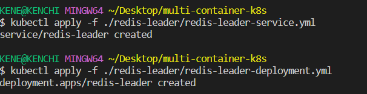
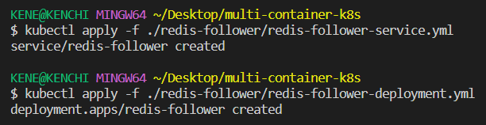
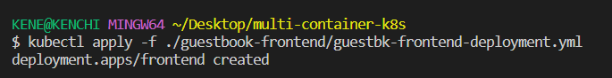
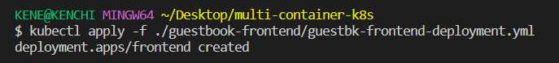
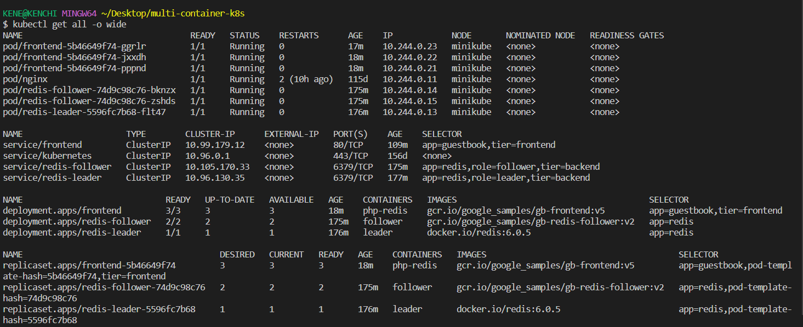
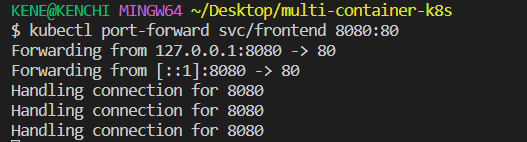
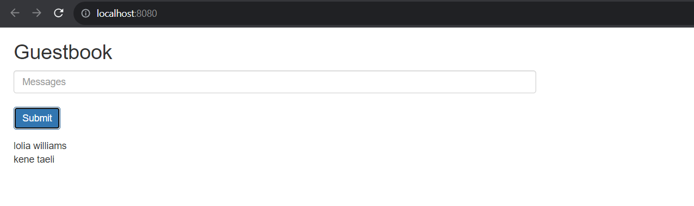

# __Deploying PHP Guestbook application with Redis.__

## __Task.__
Build and deploy a simple multi-tier web application using Kubernetes and Docker with the following components:
- A single-instance Redis to store guestbook entries.
- Multiple web frontend instances.

## __Aim and Objectives.__
The aim of this project is to build and deploy a simple multi-tier web application using Kubernetes, and the objectives include:
- Start up a Redis leader.
- Start up two Redis followers.
- Start up the guestbook frontend.
- Expose and view the Frontend Service.
- Clean up. 

## __Important Terms to note.__
- `Kubernetes` - an open-source system for automating deployment, scaling, and management of containerized applications.
- `Clusters` -  a set of nodes that run containerized applications.
- `Nodes` - a set of worker machines, that run containerized applications.
- `Pods` - the smallest deployable units of computing that can be created and managed in Kubernetes.
- `Services` - used for exposing a network application that is running as one or more Pods in a cluster.
- `kubectl` -  a command line tool for communicating with a Kubernetes cluster's control plane, using the Kubernetes API.
- `Redis (Remote Dictionary Server)` -  an open-source in-memory storage, used as a distributed, in-memory key–value database, cache and message broker.

## __Requirements.__
- Docker desktop and docker installed.
- Any Browser - to access the frontend application.
- Terminal - used to create kubernetes resources.
- A Code Editor (VS Code) - to create/edit deployment manifests.
- Minikube or Docker desktop (which kubernetes will be enabled on) - which installs a single node kubernetes cluster.

## __Folder Structure.__
- Multi-container-k8s - main folder for this project.
  - img - contains screenshots of my progress while carrying out this task.
  - guestbook-frontend - contains deployment and service files for frontend application (note that the guestbook app uses a PHP frontend. It is configured to communicate with either the Redis follower or leader Services, depending on whether the request is a read or a write).
  - redis-follower - contains deployment and service files for the guestbook application to read data.
  - redis-leader -contains deployment (with multiple replicas to make the application highly available) and service files for the guestbook application to communicate to the Redis to write its data.
  - README.md - contains the detailed steps and guidelines for this project. 

## __Steps.__
- Install and start [minikube](https://minikube.sigs.k8s.io/docs/start/).
- Create project folders using the guide provided in folder structure.
- Create the necessary kubernetes resources for  redis-leader, redis-follower and guestbook application as shown below:

- To access all resources created above, use `kubectl get all -o wide` as shown below:

- The frontend application needs to be accessed on the browser, this can be done using a service (either a clusterIP which will be port forwarded or a load balancer type which will automatically create an external IP address, I will be using the former option) as shown below:

- The frontend application can now be accessible via the browser using the forwarded port as shown below:

- The application can also be scaled up or down based on traffic by increasing/decreasing the number of replicas using `kubectl scale deployment frontend --replicas=<value>`

- Cleaning up by deleting the deployments and services which will also deletes any running Pods with:
  - `kubectl delete deployment -l app=redis`- use labels to delete multiple resources with one command.
  - `kubectl delete service -l app=redis` - use labels to delete multiple resources with one command.
  - `kubectl delete deployment frontend` - deletes deployment using name of application deployment.
  - `kubectl delete service frontend` - deletes service using name of application service

## __kubectl commands used.__ 
- `kubectl version` - displays the current version of kubernetes installed on the user's machine.
- `kubectl apply -f <filepath/filename>` - used to create a kubernetes resource.
- `kubectl get all -o wide` - retrieve information about all Kubernetes objects and adds extra information.
- `kubectl scale deployment frontend --replicas=<value>` - used to scale up or scale down running replicas in akubernetes deployment.
- `kubectl delete <resource> <name>` - used to delete a resource.

